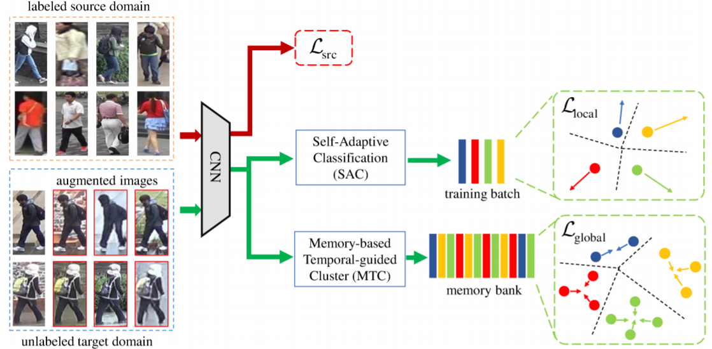

## Introduction
This is the code of [Joint Visual and Temporal Consistency for Unsupervised Domain Adaptive Person Re-Identification ECCV 2020](https://arxiv.org/pdf/2007.10854.pdf).



### Preparation

#### Requirements: Python=3.6 and Pytorch>=1.0.0

Please refer to [ECN](https://github.com/zhunzhong07/ECN) to prepare dataset, the file structure is as follow:
   
   ```
   JVTC/data    
   │
   └───Market-1501 OR DukeMTMC-reID
      │   
      └───bounding_box_train
      │   
      └───bounding_box_test
      │   
      └───bounding_box_train_camstyle_merge
      | 
      └───query
   ```
"bounding_box_train_camstyle_merge" dir merges the "bounding_box_train" and "bounding_box_train_camstyle" for convenience.

### Training and test
  We utilize 2 GTX-2080TI GPU for model training.
  ```Shell
  # Duke to Market-1501 training&evalution
  python duke2market_train.py
  
  # Duke to Market-1501 evalution with joint similarity
  python duke2market_evaluate_joint_sim.py
  
  # Market-1501 to Duke training&evalution
  python market2duke_train.py
  
  # Market-1501 to Duke evalution with joint similarity
  python market2duke_evaluate_joint_sim.py
  
  ```

### Results

 


### References

- [1] Invariance Matters: Exemplar Memory for Domain Adaptive Person Re-identification. CVPR 2019.

- [2] Spatial-temporal person re-identification. AAAI 2019.


### Citation

If you find this code useful in your research, please consider citing:


### Contact me

If you have any questions about this code or paper, please contact me at.

[Jianing Li](https://kanei1024.github.io/)
